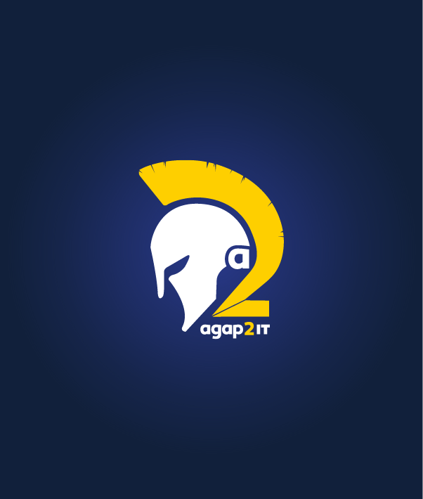
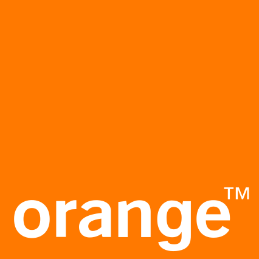
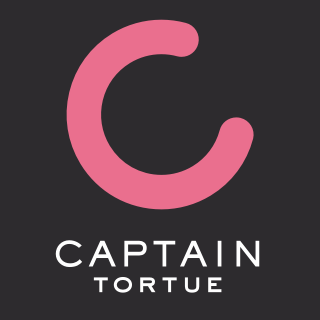

# Hi there, Welcome on my Github Page ! 

___

### About Me 🚀

I'm a **Data Scientist** based in Aix-en-Provence, France, graduated with a
Master's degree in **Applied Mathematics — Statistics & Data Science**
(Aix-Marseille University). I have experience working in large companies
(Orange, Suez) and consulting (Agap2IT), with a strong interest in
environmental and scientific challenges.

- 🔭 Currently working as **Data Analyst at Agap2IT**
- 🎓 Master in Applied Mathematics & Data Science — Aix-Marseille University
- 🌍 Based in Aix-en-Provence, open to France & abroad
- 📫 Reach me at **max.biber13@gmail.com**
- 🌐 Portfolio: [maxbiber.github.io/portfolio](https://maxbiber.github.io/portfolio)

___

## 🛠 Tech Stack

| Domain | Tools |
|---|---|
| Languages | Python · R · SQL · SAS |
| Machine Learning | XGBoost · TensorFlow/Keras · PyOD · Prophet · ARIMA/SARIMA |
| Visualization & BI | Power BI · Excel/VBA |
| Web & Automation | Django · Power Automate · SharePoint |
| Languages | French (native) · English (B2) · Spanish (A2) |

___

### My professional expericence as Data scientist/data analyst🙌

- [Agap2it](https://agap2-it.fr/) 
- [Orange](https://www.orange.fr/portail)
- [Captain Tortue](https://talents.maisoncaptain.com/)

  
  
  

___
## ⚙️ Languages & Tech Stack

**Languages :**  
<code></code>
<code></code>
<code></code>
<code></code>

| **Domain**              | **Technologies**                                                                                                                                                                                                                                        |
|-------------------------|----------------------------------------------------------------------------------------------------------------------------------------------------------------------------------------------------------------------------------------------------------|
| **Data Science & ML**   |        |
| **Web** |     |
| **AI & Automation** |    |
| **Databases** |  |
| **Environments**        |    |

## 🎓 Education

- **Master Applied Mathematics — Statistics & Data Science**, AMU (2022–2024)
- **Bachelor's in Mathematics**, AMU (2020–2022)
- **CPGE MPSI**, Lycée Thiers, Marseille (2019–2020)

---

## 🌱 Interests

🏊 Swimming · Relay Triathlon · Défi du Monté Cristo
🏓 Table Tennis (pre-regional level)
♟️ Chess (university tournaments)
🎸 Guitar & Piano
🚑 Certified First Responder — BSB & BNS

---

## 📫 Contact

